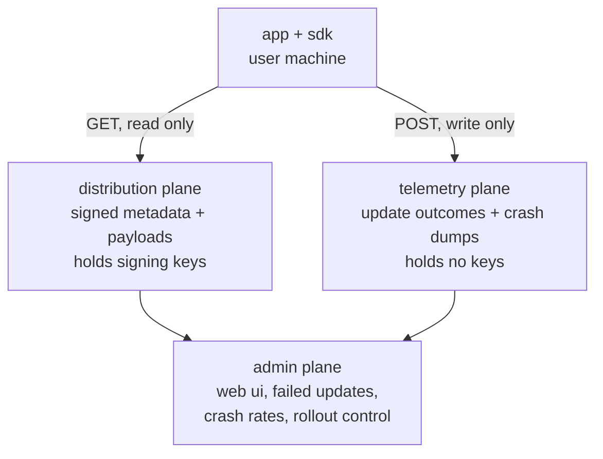
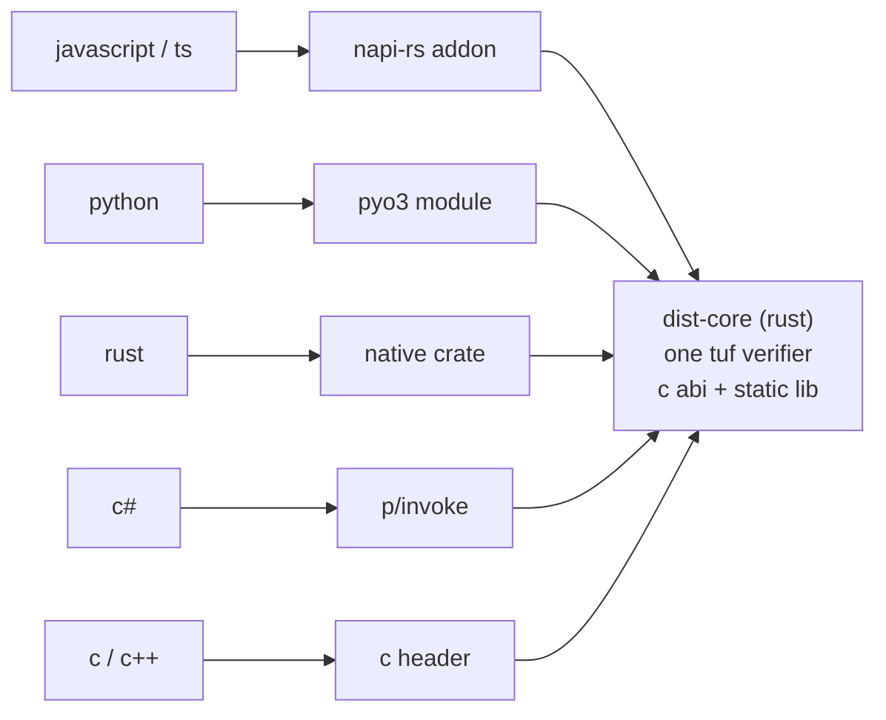
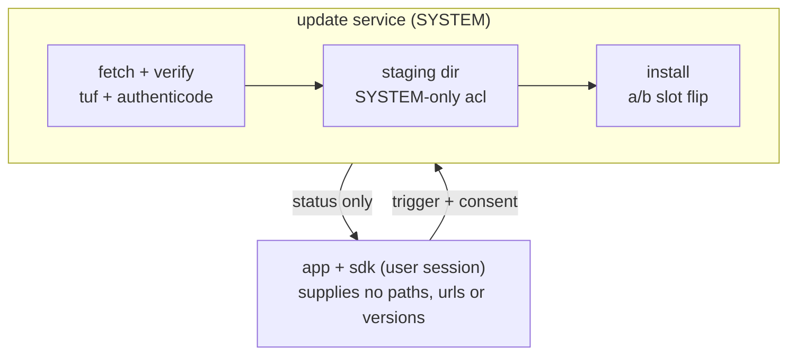

# Software distribution platform — implementation plan

Status: implementation started
Last updated: 2026-07-27

---

## 0. Implementation status

| Phase | State |
|---|---|
| 0. Foundations | `uv` workspace, ruff/mypy-strict/pytest gates and the GitLab CI pipeline are in place. Threat model and key ceremony runbook still outstanding. |
| 1. Metadata core | `dist-core` implemented: role policy, signer backends including KeePass, filesystem repository, per-app delegation, atomic publication. Exit criterion met — a spec-valid repository builds offline and verifies against a real TUF client. |
| 2. Serve + verify | Complete. Attack-simulation suite green (47 Python tests). Static edge and Compose stack written. `client/dist-core-rs` verifies real server metadata end to end and `client/dist-core-ffi` exposes the C ABI for the bindings (32 Rust tests), on a vendored fork of the `tuf` crate carrying six spec-conformance fixes including one security fix — see §5.5 and §5.6. D1 mitigations: fuzzing done; conformance suite running at 69/112 after two further fork patches — see §11.2. |
| 3. Forge ingestion | Security core complete: `dist-ingest` implements DSSE + SLSA provenance verification against both a pinned key and a Sigstore certificate identity, content-addressed quarantine, archive gates, the promotion policy, and a GitHub release source (73 tests). Exit criterion met — unattested and wrong-pipeline artifacts are rejected, and an offline-key application can only ever reach `HOLD_FOR_CEREMONY`. **The SLSA field-mapping caveat in §4.1 is resolved**: verified against a real GitHub attestation for `ONEoo7/ai_tools_git_assistant` v0.1.0, which the suite carries as an offline fixture. GitLab release source, the scheduled poll and the `dist-ingest.worker` service are now implemented, and the whole path has been **run against the live GitHub release** rather than only against fixtures — which found three faults mocks could not: the release-asset host had moved off the download allowlist, `policy.ingest` reached only the fixed-key verification path so a Sigstore bundle could never verify, and `sigstore` needs two writable XDG directories under a read-only root filesystem. **Outstanding: a malware scanner** — `ContentGates` fails closed, so a fully attested release is still rejected with "no malware scanner configured" — and the GitLab source has not been exercised against a live instance. |
| 4. Windows per-user | A/B slots, atomically replaced pointer, launcher resolution, health probation with auto-rollback, and pruning are implemented in `dist-core::install` (20 Rust tests). Exit criterion met — an update interrupted at any of six stages still resolves to a complete, launchable version, and can be retried from that state. **Outstanding: the launcher shim executable itself** and wiring the installer to the verifier's download path. |
| 5. Windows system-wide | Broker core and LPE suite implemented in `dist-core::broker` (13 Rust tests). Rules 1-5 of §6.4 and managed mode each have a test that fails when the rule is removed — verified by removing rule 4 and confirming exactly one test failed. **Rules 6-9 are not implemented**: named-pipe DACL and caller token, reparse-point hardening, safe DLL loading, minimum privileges. They belong to the Windows service that hosts this core and cannot be exercised without running as SYSTEM. |
| 6. Bindings | Python binding complete for the check path: `bindings/python` (`dist_client`) wraps the C ABI with ctypes, and `dist_client.update` runs a full check — versioned metadata chain, channel pointer, rollout — against a real repository through the real verifier, with the harness resolving nothing (46 tests). Both §5.7 gaps are closed: the channel pointer answers "which version is current", and two new ABI accessors answer "which file do I fetch next". **Outstanding: the tray integration, and install plus relaunch, which need the Phase 4 launcher shim.** JavaScript, C# and C/C++ bindings not started. |
| 7. Telemetry plane | Not started. |
| 8. Admin plane | **Source-registry slice only.** `dist-admin` is a server-rendered FastAPI/Jinja UI for registering GitHub and GitLab projects as ingestion sources, with operator login, CSRF, an audit log and a strict CSP over zero JavaScript; `dist-registry` holds the shared schema and the job queue that keeps the forge credential out of the process operators can reach. §8.2's rule holds by construction: a registered source stops at `pending_delegation` and only `dist_registry.delegate` — which reads `targets.json` and refuses unless the delegation is really there — moves it to `active`. **Not started: §8.1's health funnel, crash rates and expiry countdown** (they need Phase 7), §8.2's rollout control actions and two-person approval, and §8.3's OIDC SSO, for which the current single-operator loopback login is a stand-in. |
| 9 onwards | Not started. |

---

## 1. Purpose

A self-hosted service that distributes signed application updates to installed
desktop applications, and the client-side updater those applications embed.

The end-to-end flow:

1. An application periodically asks the service whether a newer version of
   itself exists.
2. If one does, the application shows a small in-app notification.
3. The user decides whether to install.
4. On consent, the updater downloads and verifies the new version, closes the
   running application, installs, and relaunches the new version.

Integrity and authenticity of every update are enforced with
[The Update Framework](https://theupdateframework.io) (TUF).

### 1.1 Scope

- **Server**: Python 3.13, managed with `uv`, deployed as Docker Compose.
- **Client core**: Rust, one implementation, embedded into applications through
  thin per-language bindings.
- **Application languages**: JavaScript/TypeScript, Python, Rust, C#, C/C++.
- **Platform**: Windows first. macOS and Linux are explicitly deferred but the
  client is structured so they are additive (see §7.6).
- **Install scope**: both per-user and system-wide.

### 1.2 What this is not

This is not a package registry. It does not serve `npm install`,
`pip install`, `cargo`, `dotnet nuget`, or any other package manager. The five
languages listed above are the languages that *applications* are written in,
not artifact formats to be distributed.

---

## 2. Architecture: three planes

The system is split into three planes with distinct trust properties. The split
is deliberate and load-bearing; it is not organisational tidiness.

`docs/diagrams/architecture.drawio` holds the full picture in two pages: an
architecture overview with every service, client and external system, lanes
drawn as trust boundaries and arrows labelled with what flows; and the update
activity from check to relaunch, including every failure path.



| Plane | Inbound from clients | Holds signing keys | Stores personal data |
|---|---|---|---|
| Distribution | `GET` only, anonymous | Yes | No |
| Telemetry | `POST` only, anonymous | No | Yes (crash dumps) |
| Admin | None; operators only | No | Reads both |

One component holds an outbound connection to the forge: `dist-ingest`
(§4.1), which polls for releases. It is outbound-initiated only, accepts no
inbound traffic, and its credential is **read-only**. Nothing in this system
writes to GitLab or GitHub (§8.4).

The invariant across the whole system is that **every credential is held by a
component that untrusted input cannot reach directly.** The signing worker and
the release poller have no inbound path. Telemetry ingest — the one component
anonymous clients can write to — holds no credentials at all.

### 2.1 The asymmetry that drives the design

**TUF secures downloads. It gives you nothing on the upload path.**

Every guarantee in the distribution plane — signed metadata, rollback
protection, freeze protection, offline root keys — protects bytes flowing *to*
the client. Telemetry and crash dumps flow the other way and none of that
machinery applies to them.

The telemetry plane is therefore the only place in the system where anonymous
internet clients can write, and its security has to be built from entirely
different parts. That is why it is a separate plane with its own network
segment, database, object store and credentials (§8).

A second, independent reason for the split: a bad release causes a crash storm,
and the crash storm is perfectly correlated in time with the moment the
distribution plane must be healthy in order to ship the fix. Shared resources
mean the outage removes the ability to remedy the outage.

---

## 3. TUF trust model

### 3.1 Roles

| Role | Key custody | Threshold | Expiry | Re-signed |
|---|---|---|---|---|
| `root` | `offline.kdbx`, offline media | 3-of-5 | 365 d | Annual ceremony |
| `targets` | `offline.kdbx`, offline media | 2-of-3 | 90 d | Quarterly ceremony |
| `app-<app-id>` | `online.kdbx` volume (`offline.kdbx` for critical apps) | 1 | 14 d | Per release |
| `snapshot` | `online.kdbx` volume | 1 | 7 d | On every change |
| `timestamp` | `online.kdbx` volume | 1 | 1 d | Every 30 min |

One delegated role per application, so compromise of application A's signing
key cannot forge releases for application B.

### 3.2 Compromise resilience claim

An attacker with full control of the running service and every **online** key
can cause a freeze or a denial of service. They cannot:

- forge a release for an application whose delegated role is held offline,
- roll a client back past the version it already knows about,
- mix and match versions across applications.

This claim is true only if `root` and `targets` keys genuinely stay offline.
That is an organisational property, not a code property, which is why the key
ceremony runbook is a Phase 0 deliverable and not a Phase 9 one.

With KeePass in place of hardware tokens (§3.3) the claim keeps its shape but
weakens in one specific way: **a hardware token cannot export a key, whereas a
KDBX file can be copied.** Handling of the offline media therefore *is* the
control, and it is entirely a human procedure.

### 3.3 Key storage

Keys are held in KeePass (KDBX 4.x, Argon2id KDF), in two databases with
different lifecycles:

| Database | Contents | Location |
|---|---|---|
| `offline.kdbx` | `root`, `targets`, offline per-app keys | Offline media; opened only for a ceremony |
| `online.kdbx` | `snapshot`, `timestamp`, online per-app keys | Docker volume; unsealed at worker start |

**The split is what preserves §3.2.** TUF's threat model already assumes online
keys can be stolen — that is why `snapshot` and `timestamp` exist as separate,
short-lived roles. Holding those in an encrypted file on the service host is an
acceptable degradation. Holding `root` and `targets` there is not: they are the
only thing standing between a host compromise and an attacker signing anything
they like for every user, indefinitely.

Requirements:

- **Composite master key**: password *plus* key file, with the key file on a
  different mount from the database. Theft of the volume alone is then not
  sufficient.
- `offline.kdbx` is opened only on an offline machine, during a ceremony, by a
  one-shot container. It is never a named volume on the service host and never
  present on a machine with network access.
- Signing goes through the existing `Signer` abstraction (§10). A
  `KeePassSigner` sits alongside `Pkcs11Signer` and `KmsSigner`, so a later
  migration to an HSM or KMS is a configuration change, not a rewrite.
- Neither database is ever committed to git or baked into an image layer.

**What encryption at rest does and does not buy.** For `online.kdbx` it
protects against theft of the volume or a backup. It does **not** protect
against host compromise — the worker must unseal the database in order to sign,
so anything that can read the worker's memory or its unsealing secret obtains
the online keys. That is tolerable for online roles by design; it is worth
stating plainly rather than treating the encryption as a stronger control than
it is.

### 3.4 Target naming

```
<app-id>/<channel>/<platform>-<arch>/<version>/<file>
```

Signed `custom` metadata on each target carries:

| Field | Purpose |
|---|---|
| `version` | Semantic version of the release |
| `notes_url` | Release notes shown in the in-app prompt |
| `size` | Expected payload size |
| `min_os` | Minimum supported OS build |
| `min_from_version` | Oldest version that may upgrade directly to this one |
| `mandatory` | Security-critical; client may reduce the deferral window |
| `rollout_pct` | Staged rollout percentage |

#### Delegation path patterns

TUF matches delegation paths **segment by segment** and has no recursive
wildcard, so a pattern must carry the same segment count as the paths it is
meant to cover. `<app-id>/*` matches nothing at all. That fails closed rather
than over-delegating, but it also means no release ever resolves.

The pattern is derived from the naming convention in
`dist_core.naming.app_path_pattern`, so the two cannot drift; the tests in
`tests/test_naming.py` fail if they do. A client implementation must reproduce
this matching exactly.

One consequence for clients: a delegated role can name a target such as
`app/../../x` that still satisfies the segment count. **No client may join a
target path onto a local directory without validating each segment.**

### 3.5 Rollout is client-self-selected

The client hashes `(install-id, app-id)` and compares the result against the
signed `rollout_pct`. No server-side per-client decision exists.

Consequently there is nothing for a network attacker or a compromised edge to
manipulate: a staged rollout cannot be forced to 100% by anyone who has not
broken the signing keys, and a client cannot be singled out to receive a
different build from its peers.

---

## 4. Distribution plane

```
CI ──OIDC──▶ release api ──queue──▶ signing worker ──PKCS#11──▶ KMS/HSM
                                          │
                                    object store
                                          │
                             edge (nginx, read only) ──▶ clients
```

| Service | Role | Exposure |
|---|---|---|
| `dist-edge` | nginx serving `/metadata/*` and `/targets/*` as static files | Public :443 |
| `dist-api` | Release intake and query | Internal / CI only, mTLS |
| `dist-worker` | Sole holder of signing capability | **No inbound listener** |
| `dist-scheduler` | Re-signs `timestamp`/`snapshot` before expiry | None |
| `postgres` | Release records, audit log, key *metadata* | Internal |
| `redis` | Task broker | Internal |
| `minio` | Content-addressed blob store | Internal |
| `softhsm` | PKCS#11 provider, dev profile only | Internal |

Two structural rules:

- **Metadata is never generated by a request-serving process.** The public read
  path is a static file server with no code path that can alter metadata.
- **Publication is single-writer**, serialised on a Postgres advisory lock.
  Concurrent `snapshot` writes are the standard way TUF repositories corrupt
  themselves.

Publication ordering is bin → `snapshot` → `timestamp`, timestamp last, so a
client fetching mid-publish never sees a snapshot referencing metadata that is
not yet present.

Release publication from CI authenticates with short-lived OIDC workload
identity tokens. No long-lived publish credentials are ever issued.

### 4.1 GitLab release ingestion

Releases are pulled from GitLab, either instead of or alongside the CI push
path above.

**GitLab is a source of candidate artifacts, never an authority to sign.** If
the service signed whatever appeared in a GitLab release, then anyone able to
create a release — a leaked project token, a compromised maintainer account,
GitLab itself — could have arbitrary code signed by the TUF keys and delivered
to every user. That would make the offline key ceremony decorative. Everything
pulled from GitLab lands in quarantine.

#### `dist-ingest`

A separate service with outbound egress to GitLab only. It has no inbound
listener, holds a read-only GitLab credential, holds no signing keys, and can
write only to quarantine storage.

- **Poll; do not receive.** A webhook may be accepted as a *hint* that triggers
  a poll, but the webhook payload is never trusted and never carries the
  artifact or the decision. This is the same rule as §6.4: trigger only, no
  parameters.
- **Source of truth is GitLab Releases with assets attached to protected
  tags.** CI job artifacts expire and are not durable enough to be the record.
- **Credential** is a project or group access token with read-only scopes
  (`read_api`, `read_repository`, `read_registry`), held in the secret manager
  and rotated. Never a personal access token tied to a human.

#### Promotion gates

| Gate | Check |
|---|---|
| Provenance | in-toto/SLSA attestation signed by the expected GitLab CI builder identity; subject digest matches the bytes; pipeline ran on a protected tag in the expected project |
| Tag | Protected tag; signed tag where the project supports it |
| Format | Size caps, archive path traversal, decompression ratio |
| Content | Malware scan, SBOM present, vulnerability and licence policy |
| Identity | Authenticode publisher matches the application's current publisher |

Provenance is doing the real work here. "It appeared in a release" is not
evidence of anything. "This artifact was built by pipeline X on protected tag Y
in project Z, attested by a signing identity we trust" is.

#### Two ways of establishing who signed

The payload is the same on both forges — a DSSE envelope wrapping an in-toto
Statement v1 whose predicate is SLSA Provenance v1 — but they differ in how the
signer is established, so `dist-ingest` supports both. What an attestation must
*say* is shared code (`provenance.check_statement`); only the envelope
front-end differs.

| | Fixed key | Certificate identity |
|---|---|---|
| Module | `provenance.py` | `attestation.py` |
| Forge | GitLab, anything self-signed | GitHub Actions |
| Trust anchor | pinned public key + keyid | Fulcio certificate + Rekor entry |
| Policy type | `TrustedBuilder` | `CertificateIdentity` |

**The certificate path is the stronger of the two.** GitHub has no long-lived
builder key to pin; Fulcio issues a certificate for one workflow run, bound to
the OIDC token that run presented. The claims we pin are therefore X.509
extensions written by Fulcio from that token, not assertions in the payload —
a malicious workflow controls its own predicate but not its certificate.

Pinned for each trusted identity:

| Claim | Why |
|---|---|
| OIDC issuer | The only issuer whose identities mean anything here |
| Repository | The obvious one |
| **Repository ID** | Numeric and immutable. A repository can be renamed, transferred, deleted and its name re-registered by someone else; the ID cannot be re-used. Comparing the URL alone misses this |
| **Owner ID** | Same argument, one level up |
| **Runner environment** | Must be `github-hosted`. A self-hosted runner is hardware the repository owner controls, so it can emit structurally genuine attestations for arbitrary bytes |

The SAN is deliberately *not* pinned whole: it is `<workflow_uri>@<ref>` and the
ref changes every release, so pinning it would mean a configuration edit per
release. The ref-invariant workflow URI is pinned, anchored on `@` so
`release.yml` cannot be satisfied by `release.yml.evil@…`, and the ref itself is
checked against `require_tag_ref_prefix` — which is the property actually worth
enforcing.

Verification is delegated to the `sigstore` package rather than hand-rolled
(decision D14).

**Field mapping, verified against a real attestation** rather than assumed —
this was an open assumption until GitHub ingestion was built against a live
release:

| Policy field | SLSA v1 location |
|---|---|
| `project_url` | `predicate.buildDefinition.resolvedDependencies[].uri`, as `git+<url>@<ref>` |
| `require_tag_ref_prefix` | the `<ref>` in that same URI |
| builder claim | `predicate.runDetails.builder.id`, cross-checked against the certificate |

#### Self-hosted GitLab

GitLab is self-hosted, so both outbound connections stay inside the perimeter.

- **Egress policy is an allowlist of one.** `dist-ingest` may reach the
  internal GitLab host and nothing else, and needs no public internet access.
- **Pin the GitLab certificate explicitly** — its SPKI or the specific issuing
  CA, not the OS trust store. Internal PKI usually means a broadly-trusted
  private CA under which any internal certificate would impersonate GitLab.
  Certificate pinning matters more with an internal CA, not less.
- **Release pipelines run on dedicated, protected runners**, ideally ephemeral
  (fresh VM or container per job). Shared runners are the standard weak point
  in a self-hosted install: a job from an unrelated project on a shared runner
  can reach the builder identity and forge provenance that passes every gate in
  the table above.
- **Pin a minimum GitLab version** — the protected-tag and release-asset APIs
  this design depends on vary across releases.
- **GitLab availability is not on the client's critical path.** If GitLab is
  down, no new releases are ingested, but already-signed releases continue to
  serve normally.

#### One assumption to confirm

`dist-ingest` reads the source repository and ref from
`predicate.buildDefinition.resolvedDependencies[]`, matching a URI of the form
`git+<project>@<ref>`. That is the SLSA v1 convention, but **the exact shape of
GitLab's own provenance has not been checked against a real pipeline.** If
GitLab records the source elsewhere — under `externalParameters`, say — the
extraction in `provenance.py` needs adjusting.

The failure mode is safe: an attestation whose source cannot be located is
rejected, not accepted. So this shows up as releases refusing to promote rather
than as unverified artifacts getting through.

#### Where automation stops

- Applications with **online** delegated keys auto-promote once every gate
  passes.
- Applications with **offline** delegated keys require a human signing
  ceremony. Automation ends at the quarantine boundary.

The open question in §14 — which applications qualify for offline delegated
keys — is therefore also the decision about which releases may ship without a
human in the loop.

### 4.2 Adding another forge

The verification core is forge-neutral and always was, by construction rather
than by intent: DSSE and in-toto/SLSA are vendor-neutral specifications, and
both GitLab and GitHub record the source as `git+<project>@<ref>` in
`resolvedDependencies`. `tests/test_ingest.py::test_provenance_is_forge_neutral`
runs the whole provenance path against GitHub-shaped values and passes with no
change to `provenance.py`; a companion test confirms configuring both forges
does not let either vouch for the other's repositories.

So "support GitHub too" is not a change to the security core. Three other
things do change.

**The fetch layer.** `dist-ingest`'s poller — which is not built yet — needs a
second implementation for the GitHub Releases API. This is the smallest piece
and the reason to define the source as a trait before writing the first one.

**The credential model.** GitLab uses a read-only project or group access
token. GitHub would use a GitHub App installation token or a fine-grained PAT,
with a different rotation story. "Protected tag" is also a different mechanism
on each — GitLab protected tags, GitHub rulesets — so §4.1's tag gate needs a
per-forge answer.

**Egress, and this one is a decision rather than a detail.** D12 chose
self-hosted GitLab specifically so both outbound connections stay inside the
perimeter, and §4.1's egress policy is an allowlist of one internal host.
Adding github.com puts public internet egress into the publish path. That does
not make the design unsound — provenance is what establishes trust, not the
network — but it retires a property the plan currently claims, and the egress
allowlist and threat model both need updating to say so.

#### The one that is not small: keyless attestations

`TrustedBuilder` holds a **static public key**. That fits GitLab CI signing
with a key you control, and it fits `slsa-github-generator` when configured
with your own key.

It does **not** fit GitHub's native artifact attestations, which are Sigstore
keyless: a short-lived Fulcio certificate bound to an OIDC identity, recorded
in Rekor. Verifying those means chaining the certificate to a Fulcio root,
checking its SAN and extensions against the expected repository and workflow,
and optionally proving Rekor inclusion — a different trust model, not a
different key format. It also adds Fulcio and Rekor to the egress allowlist.

Two ways forward:

| Option | Cost | Consequence |
|---|---|---|
| **Require a static-key attestation** — sign in the workflow with a key you hold | None; works today | Keeps one trust model across both forges and no new egress. Gives up GitHub's built-in attestation UX |
| **Implement Sigstore verification** | A new verifier alongside the DSSE one | Uses GitHub's native attestations as published, at the cost of a second trust model and two more external dependencies in the publish path |

Recommendation is the first until there is a concrete reason otherwise: it
keeps one thing to audit rather than two, and the second can be added later
behind the same `verify_provenance` entry point without disturbing anything
above it.

---

## 5. Client architecture



### 5.1 One verifier, five bindings

Verification is implemented once, in Rust, and exposed as a static library plus
a C ABI. The per-language bindings are thin and contain no security-critical
logic.

The alternative — each SDK using its own ecosystem's TUF library — was rejected
because the available libraries are not comparable in maturity:

| Language | Native TUF library | State |
|---|---|---|
| Python | `python-tuf` 7.x | Reference implementation, full delegation support |
| JS/TS | `tuf-js` (shipped by npm via `@sigstore/tuf`) | Mature, full delegation support |
| Rust | `tough` | No delegated-role support |
| Rust | `tuf` crate | Delegations supported; API unstable (see §11, D1) |
| C# | `tuf-dotnet` | Young, single maintainer |
| C/C++ | — | No viable option |

Two are solid, two are compromised, one does not exist. Per-language libraries
would mean five security-critical verifiers to audit, five CVE streams to
track, and a C/C++ gap that would have to be closed by hand-writing a TUF
client — the worst possible thing to hand-roll.

### 5.2 What the language SDKs contain

- `check()` — returns available version, notes, size, mandatory flag
- `on_update_available` — callback so the application renders its own
  notification in its own toolkit; the SDK ships no UI
- `apply()` — hands off to install

Verification never happens in a binding. A defect in the C# binding cannot
weaken the signature check.

### 5.3 Update flow

```
check ─▶ notify ─▶ user consents ─▶ download ─▶ verify ─▶ stage
      ─▶ app exits ─▶ pointer flip ─▶ relaunch ─▶ health check
      ─▶ (on failure) auto-rollback
```

`verify` is three checks in order: TUF metadata and target hash, then the
platform code signature, then that the signing identity matches the currently
installed application.

Verification runs against the file on disk immediately before install, not only
after download — otherwise the staging directory is a time-of-check to
time-of-use window. Staging uses a directory with restrictive ACLs, never a
world-writable temporary directory.

### 5.4 Tooling constraint on Windows

`python-tuf` 7.0.0's `ngclient.Updater` creates a symlink for `root.json` when
it starts. Creating a symlink on Windows requires Developer Mode or elevation,
so on a stock machine it raises `WinError 1314`.

This does not affect the shipped client, which is the Rust core (D2), but it
constrains any Python-side client tooling on Windows — and it is the same
restriction that rules out symlinks for the install pointer in §6.1. The test
suite shims it; production tooling must either avoid `ngclient` on Windows or
require Developer Mode.

**It reaches further than `ngclient`.** `sigstore`'s trust root is itself
distributed over TUF, so `Verifier.production()` hits the same wall on a stock
Windows machine — a second, independent consumer of `python-tuf`. Treat this as
a property of running any TUF client on Windows rather than as one library's
quirk. The services run in Linux containers, so it is a developer-machine
constraint only.

Two details cost real time and are worth writing down:

- **A symlink target resolves relative to the link's own directory**, not the
  working directory. A copy-instead-of-symlink shim that ignores this fails
  with a `FileNotFoundError` naming a path that looks correct.
- **The shim must be installed at import, not as an autouse fixture.**
  Session-scoped fixtures are instantiated before any function-scoped fixture
  runs, so a fixture-based shim left `sigstore` unpatched and its tests
  skipped — which in a summary line is indistinguishable from tests that
  passed.

---

### 5.5 The `tuf` crate fork

Building the verifier surfaced four defects in `tuf` 0.3.0-beta9. Three stopped
it parsing metadata that `python-tuf` 7.0.0 produces; the fourth is a security
vulnerability. Decision D1 resolved to fork and fix (option A), which is the
contingency D1 had already budgeted for.

The crate is vendored at `client/vendor/tuf` and wired in with
`[patch.crates-io]`. Each change is marked `FORK PATCH <n>` in the source and
described in `client/vendor/tuf/PATCHES.md`. **All four patches move the crate
towards the specification**, so none are project-specific and all are
upstreamable. Upstream's own suite still passes — 189 tests, one of which
asserted a defect and was updated.

| # | Defect | Effect |
|---|---|---|
| 1 | `spec_version` compared as an exact string against `"1.0"` | Rejects `python-tuf`'s precise `1.0.31`. The specification requires a *major*-version check |
| 2 | Glob delegation paths not implemented; `*` is an illegal path character | `app/*/*/*/*` rejected at parse. Upstream matches directory prefixes only |
| 3 | Delegation role field read as `role` | The specification calls it `name`, so no conforming metadata could be read |
| 4 | **Delegation paths never enforced** | See below |

#### Patch 4 is a security vulnerability

Upstream guarded the delegation path check with `current_depth > 0`, so at the
first delegation level **no path check ran at all**, and at greater depths it
checked a parent set that excluded the current delegation's own paths. A
delegated role's `paths` were therefore never enforced against its own targets.

**Any delegated role could sign any target path.** For this system that means a
compromise of one application's signing key could forge releases for every
other application — the precise property §3.1 claims, and the reason D1 chose a
crate with delegation support in the first place. Without the fork, the
per-application isolation in the trust model would have been decorative on the
client side.

It was found by `delegated_role_cannot_sign_outside_its_path` in
`client/dist-core-rs/tests/interop.rs`, which publishes a genuinely-signed
out-of-scope target through the Python server and requires the Rust client to
refuse it. **This should be reported upstream.**

#### Why the interop fixtures matter

`scripts/gen_rust_fixtures.py` builds a real repository with the Python server
and writes it to `client/dist-core-rs/tests/fixtures`. The Rust tests run
against those bytes rather than hand-written metadata, which is why all four
defects surfaced at once instead of reaching production. Metadata expires, so
the fixtures record their generation time and the tests pin the clock to it via
`TufVerifier::bootstrap_at`.


### 5.6 The C ABI

`client/dist-core-ffi` is the boundary the JavaScript, Python, C# and C/C++
bindings call through. It is a **separate crate** from the verifier so that
`dist-core` keeps `#![forbid(unsafe_code)]`: every unsafe line in the client
sits in one small file, and none of it makes a security decision.

Four rules shape it:

- **Nothing unwinds across the boundary.** Every entry point is wrapped in
  `catch_unwind`, because unwinding into a foreign frame is undefined
  behaviour. A caught panic returns `DIST_PANIC` and the handle is dead.
- **Every pointer is checked**, including for zero-length buffers —
  `slice::from_raw_parts` is undefined behaviour on a null pointer even when
  the length is zero.
- **No allocation crosses the boundary.** Results are written into caller-owned
  fixed-size storage, so there is no free function to pair wrongly and no
  allocator mismatch between runtimes. `DistVerifier` is the single exception
  and has an explicit `dist_verifier_free`.
- **Target paths are validated before use**, so a delegated role cannot smuggle
  a traversal component through a pattern TUF would otherwise accept (§3.4).

`include/dist_core.h` is hand-written, which means it can drift from the Rust
and produce silently misaligned reads in every binding at once.
`target_info_layout_is_pinned_to_the_c_header` asserts the exact size,
alignment and field offsets so drift fails a test instead. Generating the
header with `cbindgen` would remove the risk entirely and is worth doing before
the bindings land.

The Python binding asserts the same numbers a third time, in ctypes. Two
independent restatements of a layout are worth more than one, because the
failure being guarded against is not a crash — it is a digest read from the
wrong offset, which verifies happily against the wrong bytes.

---

### 5.7 How a client discovers the current version

Building the first binding surfaced a gap that the design had not addressed.

A target path is `<app>/<channel>/<platform>-<arch>/<version>/<file>` (§3.4),
so **resolving a target requires already knowing the version**. The ABI offers
exact-path lookup and nothing else, and `ReleaseSource::available()` in the
broker is a trait with no implementation. There is therefore no answer today to
the very first question an application asks: *is there a newer version of me?*

Two ways out:

**Enumerate.** Add an ABI call that scans verified targets under a prefix and
returns the highest version. No extra round trip and no new target to publish,
but it needs a version-ordering rule in Rust, and — the deciding objection —
*the newest published version is not necessarily the one that should be served*.
A release held at 0% rollout, or a channel deliberately rolled back, cannot be
expressed by "highest version present".

**A channel pointer.** Publish a small signed target at a fixed, version-free
path — `<app>/<channel>/<platform>-<arch>/current.json` — whose contents name
the current version. The client resolves that path (which it can construct
without knowing anything), verifies and downloads it, reads the version, then
resolves the artifact.

The pointer is preferred. It is a target like any other, so it inherits the
whole trust chain: it cannot be forged without the app's delegated key, and
snapshot plus timestamp prevent it being rolled back or frozen. More
importantly it expresses *intent* rather than inventory, which is what staged
rollout and rollback actually need.

Cost: one extra round trip per check, and `add_release` gains a companion
operation that updates the pointer — deliberately separate, so publishing a
release and making it current stay distinct acts.

**Implemented.** `ChannelKey`/`CurrentRelease` in `naming.py`,
`FileSystemRepository.set_current`, and `dist_client.update.UpdateCheck`.

Three details that turned out to matter:

- **The pointer's version segment is `_current`, which `_SEGMENT` forbids.** No
  `TargetKey` can render that path, so a release can never shadow the pointer
  and the pointer can never shadow a release. The reservation is enforced by
  the existing validator rather than by a list of forbidden names someone has
  to remember to update.
- **It is five segments**, like every release path, so the app's existing
  delegation pattern covers it unchanged. Four would have failed closed and
  silently: the delegated role simply could not sign it.
- **The client must check the pointer names a target inside its own channel.**
  This is the one way the design could be abused. A pointer's contents are
  signed, but they are still a string chosen by whoever holds the app key, and
  pointed at another application's target the verifier resolves it happily —
  a different role legitimately owns that path — handing the user someone
  else's binary. `RedirectRefusedError`, with a test that publishes a
  correctly-signed cross-app pointer.

The pointer also carries signed `ReleaseInfo` like any other target, with
`rollout_pct` fixed at 100: the pointer must be readable by every install,
because rollout is decided on the release it names, not on the pointer.

#### Fetching metadata in consistent-snapshot order

With consistent snapshots the metadata files are `<version>.<role>.json`, and a
client learns each role's version from the role above — timestamp names
snapshot's version, snapshot names the targets versions. The ABI originally
verified raw bytes fed in order but reported no version numbers, so a client
could not work out what to fetch next.

Serving unversioned aliases from the edge would have made that go away and
reintroduced exactly the race consistent snapshots prevent: a cache serving one
role from one publish and another role from the next. So the fix went into the
ABI instead.

**Implemented**: `dist_verifier_snapshot_version` and
`dist_verifier_targets_version` (the latter covering both `targets` and any
delegated role), returning `DIST_MALFORMED` while the role above has not been
accepted. Every number comes from verified metadata, never from a filename or
an unsigned response.

Two things make the tests meaningful rather than decorative:

- `scripts/gen_rust_fixtures.py` records the versions the server actually
  assigned, so the interop test asserts the ABI reports *those*, not merely
  that it reports a number. A further test asserts two of the roles differ, so
  an accessor returning the same value for everything cannot pass.
- `tests/test_update_check.py` serves the repository byte for byte and
  resolves nothing. An earlier version of that helper resolved the newest
  versioned file when asked for a bare `snapshot.json` — which let the client
  pass without ever following the chain, because the harness was doing the
  client's job. An unversioned request for a versioned role is now a 404,
  exactly as the edge would answer.

---

## 6. Windows install model

### 6.1 A/B slots with a launcher shim

Windows has no atomic directory re-point. Symlinks require administrator rights
or Developer Mode; junctions can be created unprivileged but there is no atomic
replace for a directory. So the design does not use a directory pointer at all.

```
%LOCALAPPDATA%\Vendor\App\
  App.exe          <- stable launcher shim, signed, rarely changes
  current.json     <- pointer file, atomically replaced
  versions\1.4.1\  <- previous, retained for rollback
  versions\1.4.2\  <- new
  staging\
```

`MoveFileEx(..., MOVEFILE_REPLACE_EXISTING)` on a *file* is atomic on NTFS, so
activation and rollback are both a single pointer rewrite.

Three properties fall out of this:

**No file-lock problem.** A running `.exe` or `.dll` cannot be overwritten on
Windows. Because A/B never touches the running version's files, the entire
class of problem disappears.

**Shortcuts survive updates.** Start menu entries, pinned taskbar items, file
associations and protocol handlers all point at the stable `App.exe` path.
Updaters that install into version-named directories break pinned shortcuts on
every release.

**Install is decoupled from restart.** Staging and installation can complete
entirely in the background while the application runs. Only the pointer taking
effect requires an exit. The privileged service therefore never has to
coordinate application shutdown and never has to `CreateProcessAsUser` into the
user's session — the application exits itself and the shim starts the new
version.

A consequence worth noting: **per-user mode needs no privileged helper at
all.** The application writes its own pointer file and exits. An out-of-process
helper is still required for two narrow jobs — replacing the shim itself, and
deleting old version directories that may be locked.

### 6.2 The two scopes

| | Per-user | System-wide |
|---|---|---|
| Install root | `%LOCALAPPDATA%\Vendor\App` | `%ProgramFiles%\Vendor\App` |
| Staging | Same tree, user ACL | `%ProgramData%\Vendor\App\staging`, SYSTEM-only DACL |
| Installer | In-process, no elevation | SYSTEM service |
| Uninstall entry | `HKCU` | `HKLM` |
| Elevation | Never | Install time only |

Scope is fixed at install time and is never runtime-selectable. The updater
refuses to operate cross-scope: a per-user updater must never write into a
system-wide install. Both present on one machine is a detectable
misconfiguration and is reported, not silently resolved.

### 6.3 Managed mode

System-wide mode must support a Group Policy / registry switch for *check and
report only, defer install to the management system*.

Many enterprises actively do not want machine-wide software self-updating,
because it bypasses their change control. This is cheap to build alongside the
service and is the first thing an enterprise deployment will ask for.

### 6.4 Privileged broker



These are the local-privilege-escalation prevention rules. Rules 1 and 3 are
the ones that actually bite.

1. **The unprivileged side supplies no parameters.** The only verbs crossing
   the boundary are *check now*, *user consented*, and *report status*. No
   path, URL, version or channel. If the application can say "install from X",
   the product ships a local privilege escalation.
2. The service resolves everything from its own configuration and performs its
   own TUF verification.
3. **The staging DACL is explicit and restrictive** (SYSTEM + Administrators),
   never inherited. A user-writable staging directory lets the user swap the
   verified payload between verification and install.
4. Re-verify the TUF hash and the Authenticode signature from inside the
   elevated process immediately before use — not once at download time.
5. **Authenticode publisher pinning.** The new binary's certificate must chain
   to the expected publisher *and* match the currently installed application's
   publisher. TUF secures the channel; Authenticode secures the file at rest
   and satisfies SmartScreen.
6. Named-pipe IPC with an explicit DACL; verify the caller's token; keep the
   verb set minimal.
7. **Reparse-point hardening.** Every file operation opens with
   `FILE_FLAG_OPEN_REPARSE_POINT` and operates on handles, not paths. Junction
   and mount-point redirection is the standard technique for hijacking
   privileged file operations on Windows.
8. **Safe DLL loading.** `SetDefaultDllDirectories(LOAD_LIBRARY_SEARCH_SYSTEM32)`
   and fully-qualified paths. A SYSTEM service loading a DLL from a
   user-writable directory is an immediate escalation.
9. Minimum required privileges, no interactive desktop.

### 6.5 Windows specifics to budget for

- **Antivirus interference** is the most underestimated failure mode. Freshly
  written binaries get locked or quarantined mid-install. Every file operation
  needs retry with backoff, with `MOVEFILE_DELAY_UNTIL_REBOOT` as a last
  resort.
- **SmartScreen reputation** requires an EV Authenticode certificate or Azure
  Trusted Signing; without it every new version triggers a warning.
- **Sign everything** — application, shim, helper, service, installer — with
  RFC 3161 timestamps so signatures outlive the certificate.
- **Old-version cleanup** retains N-1 for rollback and handles locked
  directories.

### 6.6 Keeping macOS and Linux cheap later

Four traits in `dist-core`, with no Windows vocabulary in the core types:

| Trait | Windows | macOS | Linux |
|---|---|---|---|
| `InstallLayout` | `%LOCALAPPDATA%` / `%ProgramFiles%` | `~/Applications` / `/Applications` | `~/.local` / `/opt` |
| `PointerSwap` | Pointer file + shim | Bundle replace | Symlink swap |
| `PlatformSignature` | Authenticode | codesign + notarization | Detached signature |
| `PrivilegedBroker` | SYSTEM service | `SMJobBless` + XPC | polkit + systemd |

The shape is identical on all three platforms: unprivileged requester,
privileged decider, root-only staging, verify-before-execute. Only the IPC
mechanism and the signature verification differ, so macOS and Linux become four
trait implementations rather than a second client.

---

## 7. Telemetry plane

### 7.1 The threat that matters most

Forged failure reports are an **availability attack on the update system
itself**. An attacker who makes version 1.4.2 appear to be failing for 40% of
installs induces an operator to halt or roll back the rollout — and 1.4.2 is
the security fix. The attacker never touches a signing key and never breaks
TLS. They lie to the dashboard.

The primary mitigation is architectural rather than cryptographic:

- **Telemetry never triggers automated rollback.** Every rollback is
  human-initiated and two-person approved.
- **The admin UI visually separates unverified client claims from
  server-observed facts.** Edge download counts come from nginx logs and are
  far harder to forge at scale than client-submitted reports.
- **Divergence between the two is itself an alert.** A client-reported install
  count materially exceeding edge-observed downloads means someone is
  manufacturing telemetry.

This costs almost nothing to build and defeats the attack outright. Everything
below raises the cost of attempting it; the above makes the attempt pointless.

### 7.2 Client attestation without client identity

The distribution feed is anonymous, so telemetry cannot lean on user
credentials — and should not, since that would make every update check
personally identifiable.

Instead: on first run the client generates a keypair and enrols
(unauthenticated, rate-limited per IP, with a small proof of work) to receive a
short-lived token bound to that public key. Every report is signed and carries
a nonce and timestamp; the server rejects stale or replayed reports.

This does not stop a determined attacker from enrolling repeatedly, but it
converts free-form spam into metered work and provides per-install
rate-limiting and revocation.

The token layer sits behind an interface so that Privacy Pass-style
blind-signed tokens can replace it later. That yields rate-limiting and
legitimacy checks with no server-side ability to link reports to installs at
all. It is the correct long-term answer and the wrong thing to build in v1.

### 7.3 Hard limits, enforced at the edge

| Control | Value |
|---|---|
| Outcome event body | ≤ 4 KB, strict schema, unknown fields rejected |
| Crash dump body | ≤ 20 MB (configurable), content-length enforced before read |
| Decompression ratio | Capped; bomb detection before parse |
| Rate limit | Per-IP and per-install, separate budgets |
| Load shedding | Telemetry sheds before distribution degrades, never the reverse |

### 7.4 Isolation

Own network segment, own database, own object store bucket, no credential that
reaches the distribution plane, no shared secrets.

The ingest service holds **INSERT-only** database grants and a **write-only**
bucket policy. A full compromise of ingest therefore cannot read other users'
crash dumps — it can only add to a pile it cannot see.

### 7.5 Dumps are hostile input

Minidump parsing and symbolication is a genuine remote-code-execution surface.
Parsing never happens in the ingest process. Processing runs in an isolated
worker: no network egress, non-root, read-only root filesystem, seccomp,
resource-capped, ephemeral per job.

### 7.6 Transport

TLS 1.3, with the client pinning the telemetry endpoint's SPKI. Pinning matters
more here than on the distribution path precisely because TUF is not backing
this one up.

### 7.7 Privacy

- `install-id` is random, rotates roughly every 30 days, and is never derived
  from hardware.
- Client IP is truncated or hashed at ingest and never stored raw.
- Outcome telemetry is opt-out. **Crash dumps are opt-in.** Minidumps contain
  process memory and are personal data under GDPR; they are treated as such
  from day one.
- Scrub at ingest (environment, command line, obvious secret patterns), encrypt
  at rest under a key the ingest service cannot read, 30–90 day retention,
  access-logged.

### 7.8 What a failure report contains

Rotating `install-id`, `app-id`, from/to version, platform and architecture,
failure stage, error code. No paths, usernames, hostnames or stack traces —
those belong to the crash service, where consent and retention are explicit.

Stages: `check`, `download`, `verify`, `stage`, `swap`, `relaunch`, `rollback`.

### 7.9 The security signal

**`verify`-stage failures are the highest-value telemetry the system
produces.** A spike means a machine-in-the-middle, a tampered mirror, or a
botched signing run. This is wired to paging before the dashboard is finished.

Absence of signal is also signal. Alert on anomalous *drops* in telemetry
volume — suppressing reports is the natural move for an attacker who has just
been caught by them.

---

## 8. Admin plane

FastAPI with Jinja and HTMX, server-rendered. This is an internal operations
tool, not a product surface: server rendering means no separate build
toolchain, a strict CSP is actually achievable, and the attack surface stays
small.

### 8.1 Views

- Release health funnel per app and channel: checked → offered → accepted →
  downloaded → verified → installed → relaunched, with drop-off at each step
- Failure breakdown by stage, error code, platform and source version
- **Failure clusters ranked by affected installs** (§8.4) — the review queue
  that replaced automatic issue filing
- Crash rate per release, from the crash service
- **Metadata expiry countdown** — the operational tripwire that prevents every
  client hard-failing when a signing job silently dies
- Audit log

### 8.2 Control actions

Pause rollout, change rollout percentage, force rollback, revoke a release,
flag mandatory.

One rule governs all of them: **the web application never mutates TUF
metadata.** It enqueues a job for the signing worker. The admin plane has no
signing capability and no network route to key material, which preserves the
property that the worker has no inbound listener. A compromised admin UI can
queue a bad job that gets audited; it cannot forge a signature.

Revoke and force-rollback require two-person approval.

### 8.3 Authentication and rendering

OIDC SSO with MFA, split roles (viewer / release manager).

All telemetry fields render as untrusted text. Error codes are validated
against an enum, free text is truncated and escaped, CSP is strict, and
`innerHTML` is not used. This UI displays client-supplied strings and is a
textbook stored-XSS target.

### 8.4 Failure clusters, reviewed before anything is filed

**Nothing in this system files issues.** The admin plane groups failures into
reviewable clusters and stops there; a human — or an LLM working on their
behalf — decides what becomes an issue, and creates it out of band.

That decision removes rather than adds:

- **No write credential to any forge.** `dist-ingest`'s token is read-only, so
  a full compromise of this system cannot alter a repository, an issue or a
  pipeline.
- **The attacker-reachable write path is gone.** Telemetry is anonymous and
  attacker-writable; auto-filing turned it into a path that reached the issue
  tracker, and the forgery threat in §7.1 could retarget from inducing a
  rollback to denying use of the tracker.
- **Markdown and quick-action injection stops mattering to this system.**

#### What the admin plane does instead

Clustering is still needed, and for the same reason auto-filing needed it:
without it a review surface shows forty thousand reports rather than twelve
distinct faults.

- **Fingerprint** = application + version + stage + error code + stack
  signature.
- **Cluster** by fingerprint with counts, affected-install estimates, and first
  and last seen.
- **Rank** by affected installs, so review time goes where the users are.
- **Export** a cluster as a self-contained record — aggregates plus a link back
  to the admin plane — for whatever reviews it.

#### The injection concern moves, it does not vanish

Telemetry strings are still attacker-controlled. They no longer reach GitLab
automatically, but they do reach whatever reviews them.

- **An LLM reviewing this content is reading untrusted input.** If that
  reviewer can also create issues, comment, or call other tools, the exposure
  is prompt injection with a write capability — the same risk as before, moved
  one step out. Content under review must be treated as data, and the
  reviewer's ability to act on it bounded deliberately.
- **A human pasting a cluster into an issue** can still carry a quick action or
  an `@` mention into the tracker. Exports therefore keep the §8.3 treatment:
  untrusted content fenced, leading `/` neutralised, mentions stripped.

#### `verify`-stage failures are still not for the tracker

Per §7.9 they are a possible active-attack indicator. They route to the
security paging channel, not to a review queue and not to an issue, whoever or
whatever is doing the reviewing.

---

## 9. Crash service

**Self-host Sentry rather than build.** Symbolication across PDB, DWARF, dSYM
and portable PDB, fed by a symbol store that CI populates at build time, is a
multi-quarter project and is not the differentiator here.

Crash capture is not one mechanism — it is one per runtime:

| Runtime | Capture | Symbols |
|---|---|---|
| C/C++, Rust | Crashpad/Breakpad minidump (Rust also panic hook) | PDB, DWARF, dSYM |
| C# | Unhandled exception, optional native minidump | Portable PDB |
| Python | `faulthandler` + `sys.excepthook`, traceback only | none |
| JS/TS (Electron) | Built-in `crashReporter` (Crashpad) | PDB/dSYM for native frames |

Build only the correlation layer: tag every event with the same
`(app-id, version, install-id)` used by update telemetry, so crash rate and
rollout state line up in a single admin view.

The crash module is an optional, independently-loaded part of the client SDK.
**The updater must never depend on it** — otherwise a crash-reporter defect
takes down the ability to ship the fix for it.

---

## 10. Repository layout

`uv` workspace, so the security-critical server core carries no web framework
in its dependency tree.

```
pyproject.toml              # uv workspace root
packages/
  dist-core/                # TUF metadata ops, Signer abstraction, policy
  dist-api/                 # FastAPI release intake
  dist-ingest/              # GitLab release poller, outbound only
  dist-worker/              # Signing tasks
  dist-telemetry/           # Ingest, isolated, credential-free
  dist-admin/               # Web UI
client/
  dist-core-rs/             # Rust verifier, C ABI
  dist-helper-win/          # Out-of-process installer
  dist-service-win/         # SYSTEM privileged broker
  bindings/{node,python,rust,dotnet,c}/
deploy/compose/
docs/                       # this plan, threat model, key ceremony, ADRs
tests/                      # unit, integration, conformance, attack simulation
```

The `Signer` abstraction wraps KeePass, PKCS#11 and cloud KMS behind one
interface (§3.3). A plaintext file-based signer exists only behind a
development feature flag that refuses to load when `ENV=production`.

### 10.1 Docker volumes

All mutable state lives in named volumes; containers are otherwise disposable.

| Volume | Contents | Mounted by |
|---|---|---|
| `tuf-metadata` | Signed TUF metadata | worker (rw), edge (**ro**) |
| `tuf-targets` | Published payloads | worker (rw), edge (**ro**) |
| `quarantine` | Pulled, not yet promoted candidates | ingest (rw), worker (ro) |
| `keys-online` | `online.kdbx` | worker (ro) |
| `keys-unseal` | Key file half of the composite master key | worker (ro), separate mount |
| `pgdata` | Release records, audit log | postgres |
| `telemetry-db` | Telemetry, separate instance | telemetry postgres |
| `crash-store` | Dumps and symbols | crash service |
| `minio-data` | Blob store | minio |
| `redis-data` | Queue persistence | redis |

**Mount modes encode the trust boundary.** The edge is the only publicly
exposed container and it mounts metadata and targets read-only. The worker is
the only writer. Nothing but the worker can reach `keys-online`, and the
unsealing key file is a separate mount so that a single volume disclosure is
not sufficient.

Consequences to handle:

- **No container gets the Docker socket.** Socket access is host root, and host
  root is every volume including the keys.
- **Backups now contain key material and personal data.** `keys-online`,
  `telemetry-db` and `crash-store` backups inherit the encryption, access
  control and retention rules of their sources. A backup is not an exemption
  from §7.7.
- Host-level volume encryption (LUKS or equivalent) is assumed. KDBX encryption
  is defence in depth, not the only layer.

---

## 11. Decisions

| ID | Decision | Rationale |
|---|---|---|
| D1 | Client TUF library is a vendored fork of the Rust `tuf` crate | Per-app delegated roles require delegation support; `tough` does not have it. Upstream needed six fixes, one of them a security vulnerability — see §5.5 and §11.1 |
| D2 | One Rust verifier core, five thin bindings | Avoids five security-critical verifiers of uneven maturity; closes the C/C++ gap |
| D3 | Server is a custom service on `python-tuf` 7.x | Full control of delegation layout, storage and signing; RSTUF is an OpenSSF Sandbox project without a declared production release |
| D4 | KeePass key storage, split into `offline.kdbx` and `online.kdbx` (§3.3) | Keeps `root`/`targets` off the service host, which is what makes the compromise-resilience claim real |
| D5 | Crash collection is a separate service (self-hosted Sentry) | Different trust boundary, different data sensitivity, anti-correlated availability |
| D6 | Windows first; per-user and system-wide; A/B slots with a launcher shim | No atomic directory re-point on Windows; A/B removes the file-lock class of failure |
| D7 | Telemetry never triggers automated rollback | Defeats forged-report-driven denial of service |
| D8 | Admin UI enqueues signing jobs, never mutates metadata | Preserves "worker has no inbound listener" |
| D9 | Self-hosted Docker Compose | Stated deployment target |
| D10 | GitLab release ingestion is pull-based into quarantine; provenance gates promotion | GitLab must not become a signing authority |
| D11 | Nothing files issues automatically; the admin plane clusters failures for human or LLM review | Removes the only write credential to the forge and the only attacker-reachable path into the issue tracker (§8.4) |
| D12 | GitLab is self-hosted | Both outbound connections stay inside the perimeter; no public internet egress is added to the publish path or the admin plane |
| D13 | All mutable state in named Docker volumes; edge mounts metadata read-only | Containers stay disposable and mount modes encode the trust boundary |
| D14 | Sigstore bundle verification uses the `sigstore` package rather than a hand-rolled implementation | Fulcio chain validation, SCTs, Rekor inclusion proofs and checkpoint signatures are each easy to get subtly wrong, and subtly wrong here means accepting forged builds. The cost is ~30 transitive dependencies in the component holding the forge credential; the risk of writing it ourselves is larger (§4.1) |

### 11.1 D1 — the `tuf` crate, and what it costs

The `tuf` crate supports delegated roles, which `tough` does not, and per-app
delegation is what prevents a compromise of one application's signing key from
forging releases for another. That capability is the deciding factor.

The crate documents itself as under active development, not recommended for
production, with an API that may break on patch releases. This is an accepted
risk. Mitigations, all of which are Phase 2 deliverables rather than
aspirations:

- **Pin exactly** (`=x.y.z`), never a caret range. Upgrades are deliberate,
  reviewed changes.
- **Vendor the source** into the repository so a yanked or force-pushed
  upstream cannot break or silently alter a build. Done: `client/vendor/tuf`,
  with the fork delta documented in `PATCHES.md` (§5.5).
- **Wrap it behind a `dist-core` trait** so the dependency is replaceable
  without touching the install logic, the bindings, or the platform traits.
- **Gate on the TUF conformance suite**
  ([`theupdateframework/tuf-conformance`](https://github.com/theupdateframework/tuf-conformance))
  in CI, so spec conformance is measured rather than assumed.
- **Fuzz the metadata parser** as part of the Phase 2 attack-simulation work.
  Metadata is attacker-reachable input on every client.
- **Budget for upstream contribution.** Expect to find and fix defects, and
  plan to maintain a fork if upstream velocity does not match the project's
  needs.

The wrapper trait is the important one. It converts "we depend on a
pre-production crate" into "we depend on an interface, currently implemented by
a pre-production crate", which keeps the migration cost bounded if the crate
stalls.

### 11.2 D1 mitigation results

**Fuzzing — done.** `client/dist-core-rs/tests/robustness.rs` runs a
deterministic, seeded mutation harness over every metadata role on each CI
build: byte flips, truncations and splices, plus non-JSON input. It asserts two
properties — no panic, and no acceptance of a semantically changed document.
Around 1350 mutants and 1200 random inputs currently pass.

Mutants whose *parsed JSON* is unchanged are skipped. TUF signs canonical JSON
rather than raw bytes, so a change confined to insignificant whitespace is a
no-op by design and accepting it is correct. The fixtures are pretty-printed,
so this case does arise; an early version of the harness reported it as a
finding, wrongly.

`cargo-fuzz` needs a nightly toolchain and is not wired up. It is coverage-
guided where this is not, so the two are complementary rather than alternatives.

**Conformance suite — running, 69 of 112 passing.**
`client/dist-conformance` implements the suite's client-under-test protocol and
the CI job is written (`allow_failure` while failures remain).

The first run reported 90 failed / 22 passed, all from a single cause, and
chasing it down found two more defects in the crate — now patches 5 and 6:

| | Defect | Effect |
|---|---|---|
| 5 | No ECDSA support | The suite generates `ecdsa-sha2-nistp256` keys; the crate implemented only ed25519 and RSA-PSS |
| 6 | Canonical JSON escaped too much | Wrong key IDs and failed signatures for **any** metadata with a control character in a string |

Patch 6 is the significant one. Canonical JSON escapes only `"` and `\`;
upstream delegated to `serde_json`, which escapes far more. Canonical JSON is
the input to both key-ID computation and signature verification, so the crate
could not interoperate with any repository whose keys are PEM-encoded — PEM
contains newlines, and both `python-tuf` and `go-tuf` produce such
repositories. Patch 5 alone changed nothing for exactly this reason: the ECDSA
keys parsed, then got silently dropped because their computed IDs disagreed.

Our own metadata was never affected, which is why every suite passed before and
after: we sign with ed25519, whose keys are hex and contain no control
characters.

After both patches: **43 failed, 69 passed.** The remainder cluster in
delegation-graph traversal (17), role-name quoting (4), rollback checks (5) and
key handling (3); a few more are environmental on Windows (`faketime` is not
available). None have been triaged yet, and no `.xfails` file has been written
— that is the next piece of work here.

Two caveats on how this was measured:

- **The suite does not run correctly on Windows.** The reference `python-tuf`
  client, which is certified conformant upstream, fails 22 of 24 basic tests on
  this machine — for the `WinError 1314` symlink reason in §5.4, unrelated to
  conformance. Some of the 43 are likely this rather than our fork. Results are
  only trustworthy from the Linux CI job.
- **The CI job clones from github.com**, which the egress policy in §4.1 does
  not permit. Mirror the suite into the self-hosted GitLab and repoint
  `CONFORMANCE_REPO` before enabling it.

---

## 12. Phases

| Phase | Deliverable | Done when |
|---|---|---|
| **0. Foundations** | `uv` workspace, CI, threat model, role and expiry design, key ceremony runbook, ADRs | Threat model reviewed and signed off |
| **1. Metadata core** | `python-tuf` signing service, per-app delegations, atomic publish | A spec-valid repository can be built from scratch, offline |
| **2. Serve + verify** | Static edge, `dist-core` Rust verifier, platform traits, D1 mitigations, TUF attack-simulation suite | Rollback, freeze, mix-and-match and malicious-mirror attacks all provably fail |
| **3. Forge ingestion** | `dist-ingest`, quarantine, provenance gates, promotion policy, forge release sources (GitHub and GitLab) | An unattested or wrong-pipeline artifact is rejected, and an offline-key application cannot auto-promote |
| **4. Windows per-user** | Shim, pointer file, A/B slots, health check, auto-rollback | Update survives a forced kill at every stage |
| **5. Windows system-wide** | SYSTEM service, minimal IPC, staging ACLs, publisher pinning, managed mode, **LPE attack-simulation suite** | Every rule in §6.4 has a test that fails without it |
| **6. Bindings** | Five language SDKs, notification callback | Each language completes a real update |
| **7. Telemetry plane** | Enrolment, signed reports, limits, isolation, sandboxed processing | Forged-report and flood scenarios tested |
| **8. Admin plane** | Web UI, queued control actions, two-person approval, audit | Rollback rehearsed end to end |
| **9. Failure clustering** | Fingerprinting, clustering and ranking in the admin plane, plus sanitised export for review | A forged-telemetry flood produces a noisy cluster, not an outbound action |
| **10. Crash correlation** | Sentry self-host, CI symbol upload, correlated view | Crash rate visible per rollout |
| **11. Operations** | Rotation, DR, expiry alerting, hardening pass, external review | Key rotation rehearsed on staging |

Ordering rationale: Phase 2 precedes the client install phases, and Phase 7's
adversarial tests precede Phase 8's UI, for the same reason in both cases — the
attack cases get written while the design can still change in response to them.

Phases 5 and 9 get their own adversarial suites because they prove different
claims. The TUF simulations in Phase 2 prove the distribution guarantees; the
LPE simulations in Phase 5 prove the elevation guarantees; the injection and
flood tests in Phase 9 prove that an attacker-reachable write path into GitLab
stays contained.

---

## 13. Risks

**Ceremony discipline is the real dependency, and KeePass raises the stakes.**
The offline-key design is only as strong as the organisational process behind
it, and a KDBX file can be copied where a hardware token cannot. If
`offline.kdbx` is ever opened on an internet-connected machine, or left on a
workstation "temporarily", `root` and `targets` must be treated as compromised
and rotated. Without that discipline the compromise-resilience story collapses
and the system becomes an expensive signed-file server.

**Expiry is an availability risk.** Short expiries are what stop freeze
attacks, but a KMS outage or a failed scheduler means every client hard-fails
within 24 hours. Expiry monitoring belongs in Phase 2, not Phase 9.

**A privileged updater is a permanent LPE surface.** System-wide mode adds a
SYSTEM service that an unprivileged process can talk to. The rules in §6.4
contain it; the adversarial suite in Phase 4 is what keeps it contained as the
code changes.

**GitLab becomes a trust dependency.** Even with provenance gating, a
compromise of the GitLab project, its CI runners, or the builder signing
identity produces artifacts that pass every automated gate. Self-hosting
extends this to the GitLab administrators, who can alter protected tags and
runner configuration and are therefore inside the trust boundary. Offline
delegated keys for critical applications are the only control that survives
that, which makes §14's open item about which applications qualify a security
decision rather than an operational one.

**Whatever reviews failure clusters is reading attacker-controlled input.**
Nothing files issues automatically any more (§8.4), which removes the outbound
path. The content still reaches a reviewer, so an LLM given both this input and
the ability to act — create issues, comment, call tools — reintroduces the
exposure as prompt injection. Bound the reviewer's capabilities deliberately
rather than assuming the removal of auto-filing settled it.

**The `tuf` crate may stall.** See §11.1. The wrapper trait bounds the cost.

**Antivirus and SmartScreen are schedule risk, not just polish.** False
positives on a freshly signed binary can block a rollout entirely, and
reputation on a new certificate takes time to accumulate.

---

## 14. Open items

- macOS and Linux platform trait implementations — deferred by decision, not
  yet designed in detail.
- Whether critical applications get offline per-app delegated keys, and which
  ones qualify.
- Retention and access policy for crash dumps, to be settled with whoever owns
  privacy/GDPR sign-off.
- Delta updates (bsdiff/zstd patches) — not in scope for the phases above;
  revisit once payload sizes and rollout bandwidth are measured.
